# 1.1. Módulo Design Sprint

## Introdução

O Design Sprint é uma metodologia desenvolvida pelo [Google Ventures](http://www.gv.com/sprint/). Trata-se de uma maneira colaborativa e ágil de conceituar e concretizar uma ideia, um produto, suas implementações e funcionalidades em um curto espaço de tempo. Tradicionalmente, o processo é projetado para durar 5 dias de muito trabalho.

## Metodologia

A execução da metodologia pelo nosso grupo seguiu as 5 etapas fundamentais do framework, garantindo que a transição entre o problema inicial e a solução visual fosse fluida. O processo foi conduzido da seguinte forma:

Tabela 1: Etapas do Design Sprint

| Fase  | Etapa                      | Descrição da Aplicação no Projeto                                                                                                                                                                                                                                                                                                                                                              |
| :---: | :------------------------- | :--------------------------------------------------------------------------------------------------------------------------------------------------------------------------------------------------------------------------------------------------------------------------------------------------------------------------------------------------------------------------------------------- |
| **1** | **Unpack (Compreender)**   | Fase dedicada à compilação de _insights_ com a participação de todos os membros. Realizamos um _brainstorming_ para debater os vários aspectos da solução, visando um levantamento razoável do escopo.                                                                                                                                                                                         |
| **2** | **Sketch (Desenhar)**      | Etapa focada na geração de ideias visuais com base no que foi acordado na fase anterior. Cada integrante da equipe elaborou rascunhos individuais para propor seu modelo, utilizando a técnica de _Rich Pictures_ para mapear o ecossistema da plataforma.                                                                                                                                     |
| **3** | **Decision (Decidir)**     | Momento de convergência onde ocorreu a seleção das melhores ideias e melhores _Rich Picture_. A partir dessa escolha, criamos um outro _Rich Picture_ cconcatecnando essas ideias e desenhamos o _storyboarding_ que serviu como guia para o fluxo de telas. Técnicas como de _5W2H_, _Diagrama de Causa e Efeito (ishikawa)_, _Estimativas_ e _Glossário_ também foram utilizadas nessa fase. |
| **4** | **Prototype (Prototipar)** | Fase dedicada à elaboração do protótipo da interface web do fórum. Focamos em criar uma navegação fidedigna à solução real, compatível com os fluxos desenhados no storyboard para etapas como avaliações de professores, feed de disciplinas e compartilhamento de materiais.                                                                                                                 |
| **5** | **Test (Testar/Validar)**  | Etapa de apresentação e validação da interface desenvolvida. O protótipo de média fidelidade foi análisado por 2 usuários do público-alvo (alunos da UnB) para validar a usabilidade, confirmar o atendimento dos requisitos levantados e garantir que a proposta soluciona os problemas apontados no cenário inicial.                                                                         |

## Participantes

Abaixo a tabela de participantes e suas contribuições em commits para essa fase de design sprint.

Tabela 2: Quadro de Participações

| Nome                                                   | Contribuição                                                    |
| :----------------------------------------------------- | :-------------------------------------------------------------- |
| [Angélica](https://github.com/angelicaccampos)         | Estimativas, Glossário, Rich Picture                            |
| [Brenda](https://github.com/Brwnds)                    | Estimativas, Prototipação                                       |
| [Diogo Oliveira](https://github.com/Diogo-Olivv)       | 5W2H, Diagrama de Ishikawa, Glossário                           |
| [Felipe Rodrigues](https://github.com/felipeJRdev)     | Brainstorm, Rich Picture, Diagrama de Causa e Efeito (Ishikawa) |
| [Gabriel Augusto](https://github.com/gabrielaugusto23) | Prototipação                                                    |
| [Gabriel Maciel](https://github.com/GabrielMacielBR)   | Rich Picture, Prototipação                                      |
| [João Gabriel](https://github.com/JoaoComTil)          | Estimativas, Glossário                                          |
| [João Reis](https://github.com/Joaolramos)             | Estimativas, 5W2H                                               |
| [Marcos](https://github.com/marcoslbz)                 | Storyboard, Glossário                                           |
| [Renan](https://github.com/rsribeiro1)                 | Prototipação                                                    |

## Unpack

### Brainstorming

Técnica utilizada para debater os vários aspectos da solução computacional desejada e gerar um compilado de _insights_ com a participação de todos. No nosso contexto, serviu para levantar o escopo inicial do projeto.

Imagem 1: Brainstorm

  

Fonte: [Angélica](https://github.com/angelicaccampos), [Brenda](https://github.com/Brwnds), [Diogo Oliveira](https://github.com/Diogo-Olivv), [Felipe Rodrigues](https://github.com/felipeJRdev), [Gabriel Augusto](https://github.com/gabrielaugusto23), [Gabriel Maciel](https://github.com/GabrielMacielBR), [João Gabriel](https://github.com/JoaoComTil), [João Reis](https://github.com/Joaolramos), [Marcos](https://github.com/marcoslbz) e [Renan](https://github.com/rsribeiro1), 2026.

## Sketch

#### Introdução

O Sketch representa a fase de baixa fidelidade do projeto. Nesta etapa, o foco não é a estética ou o rigor técnico, mas sim a livre expressão de ideias e a captura rápida de requisitos e fluxos de interação no contexto da FCTE.

#### Objetivo

O objetivo desta seção é registrar o processo criativo inicial da equipe. Através de desenhos informais e rascunhos, buscamos:

- Visualizar a jornada do aluno da UnB ao buscar um "bizu".

- Explorar diferentes layouts para o sistema de votação (Upvote/Downvote).

- Identificar conflitos de organização nas disciplinas que o software visa mitigar.

#### Metodologia

A metodologia adotada foi o Rich Picture. Cada membro da equipe foi incentivado a produzir sua própria visão do sistema de forma independente, utilizando ferramentas como papel e caneta ou quadros brancos digitais (Excalidraw/Miro). Esse processo garantiu que múltiplas perspectivas fossem consideradas antes da consolidação do Rich Picture Final.

### Rich Picture

#### Introdução

Esta seção apresenta a modelagem informal do sistema utilizando a técnica de Rich Picture. Cada membro da equipe utilizou a técnica para expressar sua visão inicial das necessidades e interações do sistema, servindo como base para a convergência de ideias.

#### Descrição

O Rich Picture é uma ferramenta de brainstorming visual, utilizada para explorar, entender e definir situações problemáticas complexas e "bagunçadas", especialmente aquelas que envolvem pessoas, processos e tecnologia. Ele não é um diagrama técnico com regras rígidas, mas sim um desenho livre que busca capturar a essência da situação no contexto da UnB/FCTE.

#### Objetivo

O objetivo principal deste artefato é representar visualmente todos os elementos importantes do problema e suas interconexões. Ele visa identificar pontos de vista distintos e revelar questões que poderiam passar despercebidas em uma análise puramente textual. Especificamente, busca identificar:

- A Estrutura e os Processos: As principais atividades de negócio, fluxos de trabalho e dados essenciais utilizados.

- Os Atores e Stakeholders: Pessoas (estudantes, professores, moderadores) e sistemas envolvidos e seus respectivos papéis.

- As Relações e Conexões: Como os diferentes processos, atores e dados interagem entre si.

- Os "Problemas" e Conflitos: Tensões, preocupações e pontos de melhoria, representados por metáforas visuais como "nuvens" para conflitos ou "lâmpadas" para ideias.

#### Metodologia

A metodologia aplicada para a construção deste artefato baseou-se na criação de representações visuais livres e não técnicas (Sketches). O processo focou na identificação e desenho dos fluxos e interações do sistema #TenhoUmaDica, utilizando símbolos visuais para denotar conflitos de organização nas matérias e ideias de solução coletiva.

#### Conteúdo

Tabela 3: Rich Picture de cada membro

|                                                                                          Rascunhos                                                                                          |                                                                                             Rascunhos                                                                                             |                                                                                        Rascunhos                                                                                         |
| :-----------------------------------------------------------------------------------------------------------------------------------------------------------------------------------------: | :-----------------------------------------------------------------------------------------------------------------------------------------------------------------------------------------------: | :--------------------------------------------------------------------------------------------------------------------------------------------------------------------------------------: |
| 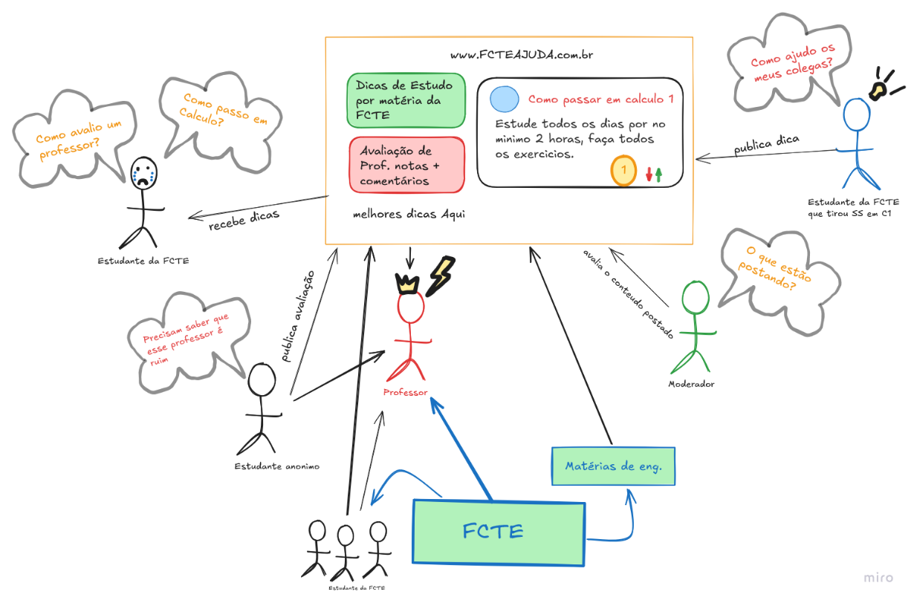   
Fonte: [Angélica](https://github.com/angelicaccampos), 2026.
  |               
Fonte: [Brenda](https://github.com/Brwnds), 2026.
            |  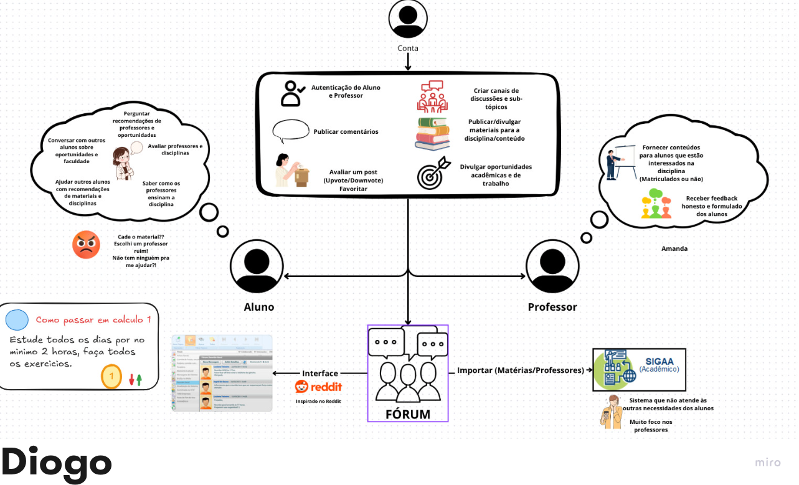   
Fonte: [Diogo Oliveira](https://github.com/Diogo-Olivv), 2026.
  |
| 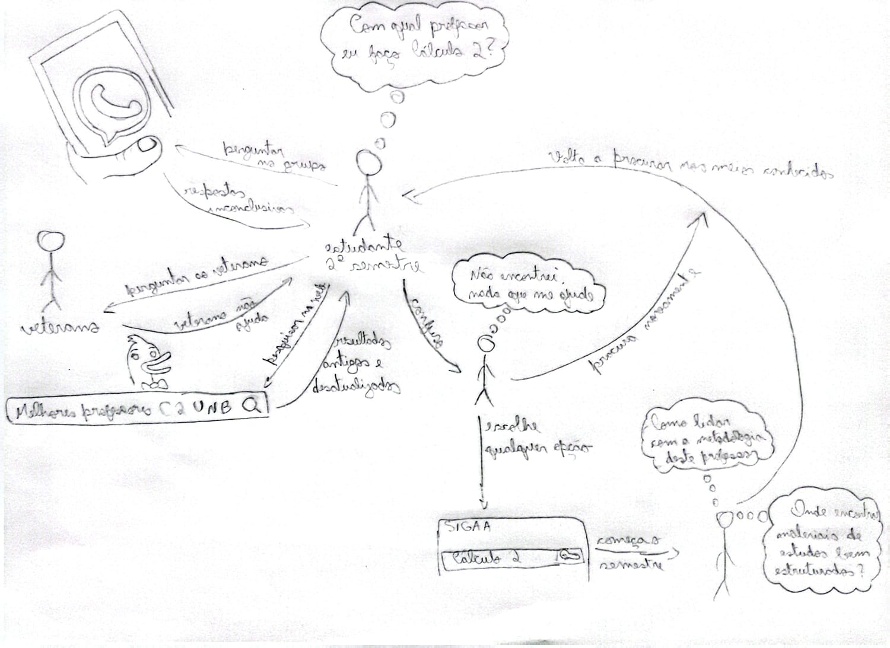   
Fonte: [Felipe Rodrigues](https://github.com/felipeJRdev), 2026.
 | 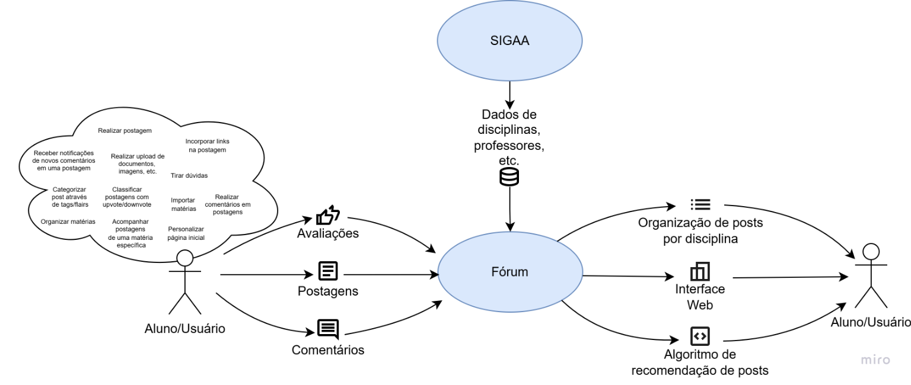   
Fonte: [Gabriel Maciel](https://github.com/GabrielMacielBR), 2026.
 | 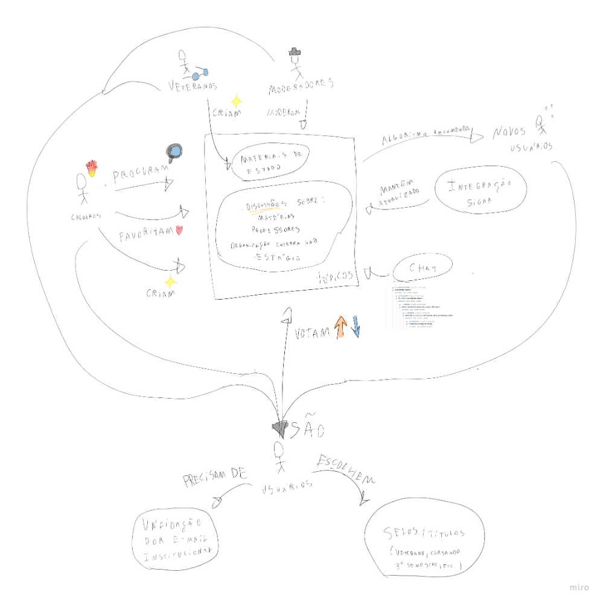   
Fonte: [João Gabriel](https://github.com/JoaoComTil), 2026.
 |
|   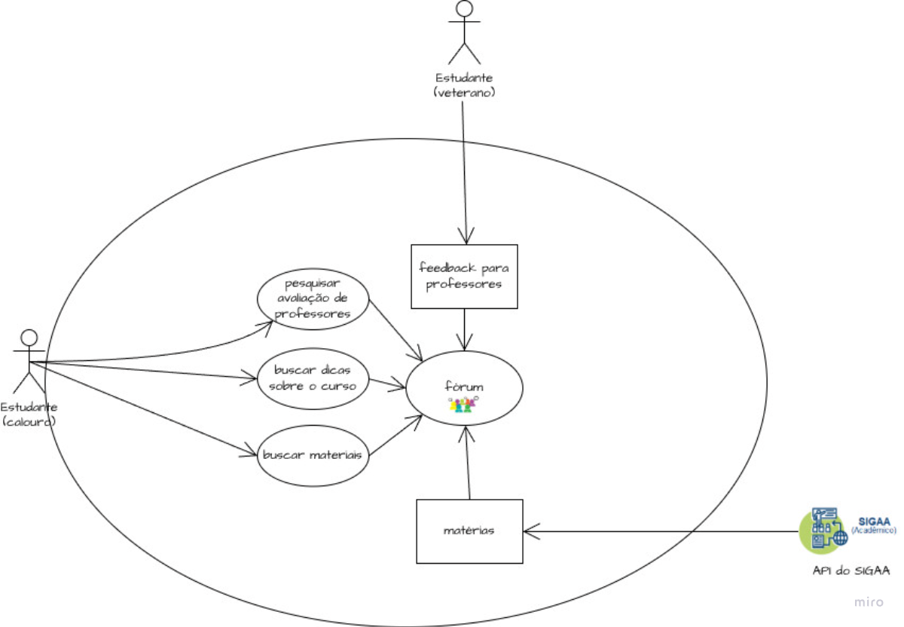   
Fonte: [João Reis](https://github.com/Joaolramos), 2026.
   |          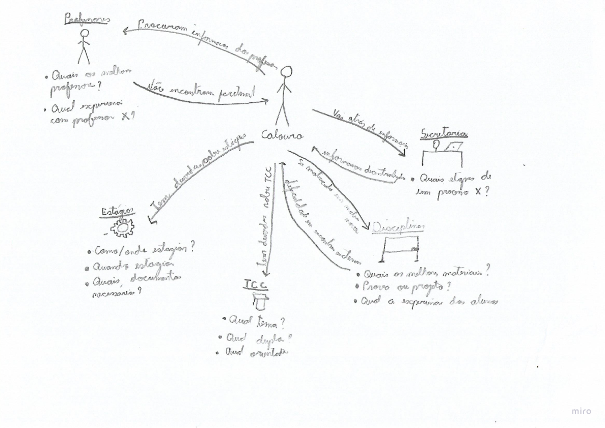   
Fonte: [Marcos](https://github.com/marcoslbz), 2026.
           |       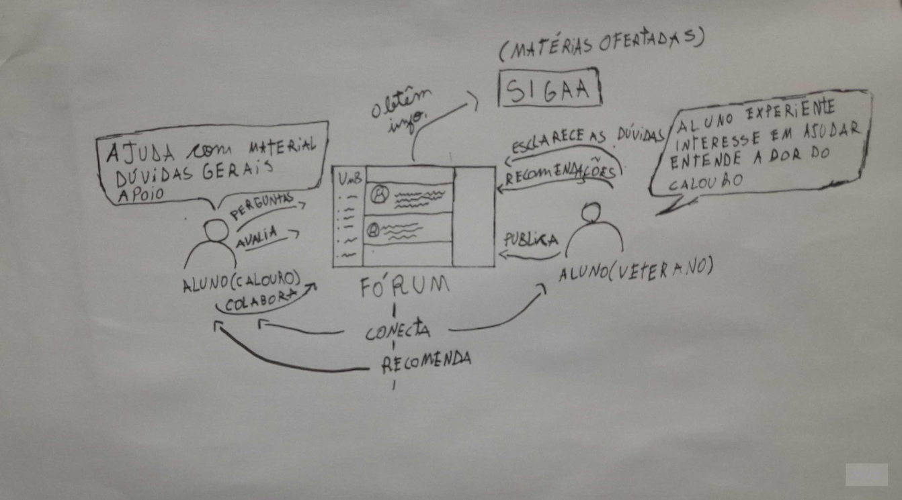   
Fonte: [Renan](https://github.com/rsribeiro1), 2026.
       |

## Decision

Após a elaboração dos rascunhos individuais (Sketches) por cada membro da equipe, o grupo realizou uma reunião de alinhamento para comparar as diferentes visões do sistema. A decisão foi baseada na escolha dos elementos que melhor representavam o fluxo de curadoria e a organização das disciplinas da FCTE. Optou-se por um modelo que equilibra a simplicidade visual com a clareza das interações entre Estudantes, Moderadores e o Banco de Dicas.

### Rich Picture Final

A partir dos rich pictures elaborados na etapa de sketch, as melhores ideias foram concatecnadas e representadas na versão final do rich picture abaixo.

Imagem 1: Rich Picture Final

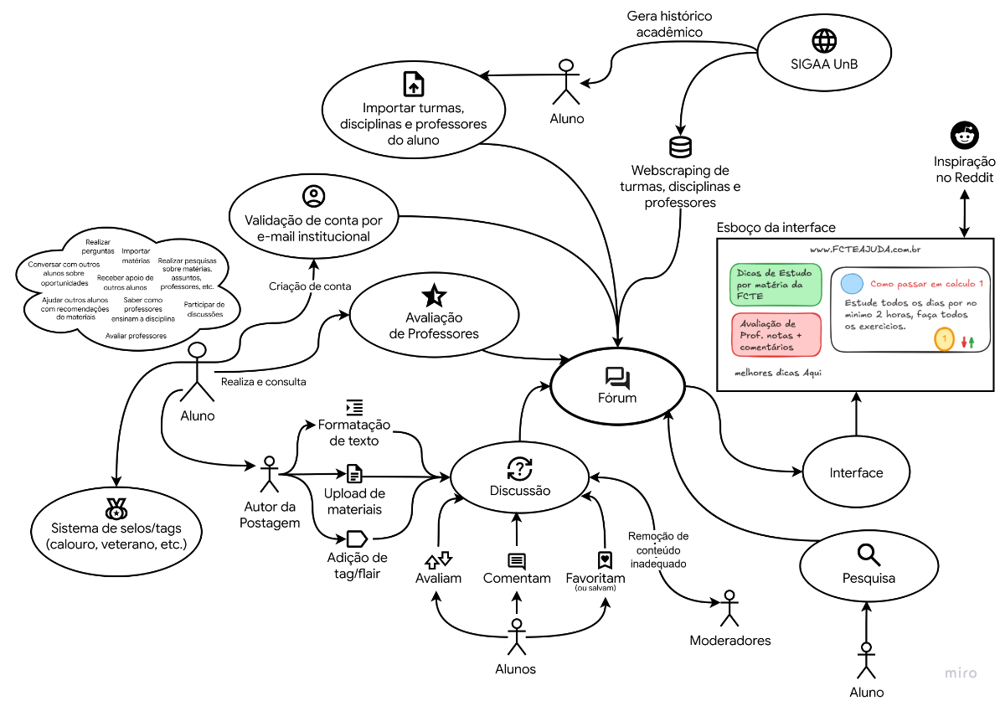

Fonte: [Gabriel Maciel](https://github.com/GabrielMacielBR), 2026.

### Storyboard

Representação visual sequencial elaborada após a escolha da melhor ideia desenhada pela equipe. O desenho do _storyboard_ atua como um guia fundamental para estruturar o fluxo de telas e direcionar a construção do protótipo final.

Imagem 2: Storyboard Calouro

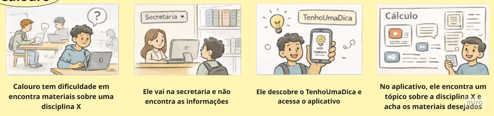

  
Fonte: [Marcos](https://github.com/marcoslbz), 2026.

Imagem 3: Storyboard Veterano

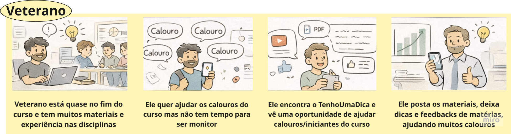

  
Fonte: [Marcos](https://github.com/marcoslbz), 2026.

### 5W2H

Framework utilizado para elaboração do plano de ação do projeto, respondendo a questões básicas de planejamento: o que, por que, quem, onde, quando, como e quanto custa.

  
<b> What (O quê): </b>

Um fórum web para alunos da UnB, focado em discussões de disciplinas, compartilhamento de materiais de estudo e avaliações de professores, com importação de dados base do SIGAA.

  
<b>Why (Por que)?</b>

  
Para centralizar a comunicação discente e organizar materiais de estudo evitando a descentralização dos conteúdos e suprindo a necessidade que o SIGAA deveria resolver, fornecendo feedback honesto e prévio sobre a didática e o perfil de cobrança dos professores.

  
<b>Who (Quem)?</b>

  
Uma equipe de desenvolvimento composta por 10 estudantes de Engenharia de Software, havendo a distinção de funcionalidades entre a equipe.

  
<b>Where (Onde)?</b>

  
A aplicação vai ser um site, disponível para qualquer dispositivo com acesso a um navegador.

  
<b>When (Quando)?</b>

  
Durante o semestre 2026.1, seguindo o cronograma geral da disciplina de Arquitetura e Desenho de Software (16/03/2026 até 29/06/2026).

  
<b>How (Como)?</b>

  
Através da construção de uma sistema web frontend inspirado no Reddit focado em usabilidade, um backend escalável para gerenciar eficientemente a quantidade de transações (logins, comentários, upvotes, moderação, postagens) e a implementação de uma integração com o SIGAA, para importar as grades e os professores da UnB.

  
<b>How much (Quanto custa)?</b>

  
Além do custo de esforço da equipe e o custo de manter a aplicação rodando na internet, o objetivo da equipe é não ter custos financeiros.

 [Diogo Oliveira](https://github.com/Diogo-Olivv), 2026.

### Diagrama de Causa e Efeito (Ishikawa)

Ferramenta visual que mapeia um problema central (o efeito) e suas raízes estruturais (as causas) divididas em categorias. Auxilia na compreensão do cenário atual para a proposição de ações corretivas.

Imagem 4: Diagrama de Causa e Efeito (Ishikawa)

  

Fonte: [Diogo](https://github.com/Diogo-Olivv) e [Felipe Rodrigues](https://github.com/felipeJRdev), 2026.

**Efeito**: Materiais e informações acadêmicas descentralizadas e falta de integração estudantil.

**Materiais**:

- Materiais sem acesso coletivo e contínuo.
- Materiais descentralizados.
- Falta de padronização dos conteúdos compartilhados.

**Meio Ambiente**:

- Conteúdos dispersos.
- Alunos desorientados.
- Pouco incentivo em auxiliar os próximos estudantes.

**Máquina**:

- Falta de um espaço digital centralizado que promova a cultura de colaboração e integração entre diferentes cursos e turmas do campus.
- O sistema oficial (SIGAA) foca apenas em processos administrativos e na visão do docente.

**Mão de Obra**:

- Calouros com dificuldade de localização de suporte para dúvidas acadêmicas.
- Estudantes veteranos sem um canal direto para conexão e mentoria de novos alunos.

**Método**:

- Compartilhamento de conteúdo fragmentado em diversas plataformas (WhatsApp, Google Drive, etc.).
- Avaliação institucional burocrática e com baixa transparência para o corpo discente.

**Medida**:

- Dificuldade no acesso universal aos conteúdos das disciplinas.
- Ausência de um sistema público e confiável de avaliação sobre a didática dos professores.
- Ausência de métricas claras sobre o nível de dificuldade real das matérias.

### Estimativa

#### Introdução

A estimativa de software é uma atividade fundamental do planejamento que visa prever os recursos, custos e cronograma necessários para o desenvolvimento do sistema. Nesta etapa, buscamos quantificar o tamanho do software e o esforço da equipe para garantir a viabilidade das entregas previstas no plano de ensino da disciplina de Arquitetura & Desenho de Software.

#### Descrição

Este artefato detalha as projeções de tamanho, esforço individual e custos operacionais do projeto. Ele serve como base para a criação do cronograma e para o rastreamento do progresso da equipe durante as sprints de desenvolvimento.

#### Objetivo

O objetivo principal é fornecer uma base sólida para a tomada de decisões da equipe, permitindo a distribuição justa de tarefas e garantindo que os comprobatórios individuais de cada membro sejam gerados conforme o esforço estimado. Busca-se minimizar incertezas e alinhar as expectativas de entrega com os prazos acadêmicos do semestre 2026.1.

#### Metodologia

As estimativas foram elaboradas utilizando o método de Avaliação de Especialistas (Wideband Delphi). O processo seguiu os seguintes passos:

- Insumos: Utilizou-se como base os resultados do Brainstorm e a visão sistêmica capturada no Rich Picture final.

- Estimativa Individual: Cada membro da equipe realizou suas estimativas de maneira anônima e separada, visando evitar a influência entre os integrantes e garantir a imparcialidade.

- Discussão de Consenso: Após a coleta individual, o grupo realizou uma discussão técnica para analisar as divergências e convergir para os valores finais apresentados na tabela de estimativas.

#### Conteúdo

Tabela 1: Estimativa

| Categoria da Estimativa               | Métrica / Método de Avaliação         | Descrição Baseada no Escopo                                                              | Exemplo de Valor Estimado - MVP                          | Pessoa A (Dev UI/UX) | Pessoa B     | Pessoa C                                                                            | Pessoa D                                                                                                | Valor Final                                              |
| :------------------------------------ | :------------------------------------ | :--------------------------------------------------------------------------------------- | :------------------------------------------------------- | :------------------- | :----------- | :---------------------------------------------------------------------------------- | :------------------------------------------------------------------------------------------------------ | :------------------------------------------------------- |
| Estimativa de Tamanho                 | Histórias de Usuário (User Stories)   | Nº de funcionalidades/histórias a serem desenvolvidas. Envolve UI, backend, integrações. | 20 a 30 Histórias de Usuário / Telas e Componentes chave | 22                   | 20           | 15 funcionalidades + 3 margem de erro 10 telas principais + variações            | 25                                                                                                      | 25–35 funcionalidades 15 telas principais + variações |
| Estimativa de Esforço                 | Esforço em dev/hora                   | Dedicação da equipe considerando sprints de 1 semana                                     | 2 horas por dia útil                                     | 1.5h                 | 2h           | 2h                                                                                  | 2h                                                                                                      | 2 horas                                                  |
| Estimativa de Custo (Operacional)     | Materiais de Consumo e Infraestrutura | Custos de servidores, hosting, assinaturas (R$/mês)                                      | R$ 0 a R$ 150/mês                                        | R$ 0                 | R$ 0         | R$ 0 (ou R$ 5/mês com hospedagem)                                                   | R$ 0 a R$ 25                                                                                            | R$ 0 no MVP                                              |
| Elaboração de Cronograma              | Prazos / Semanas Letivas              | Cronograma baseado em sprints (1 semana = 1 sprint)                                      | 8 sprints (~2 meses)                                     | 8                    | 8            | 10                                                                                  | 8                                                                                                       | 8 sprints                                                |
| Recursos de Projeto                   | Infraestrutura Técnica e Ferramentas  | Tecnologias utilizadas no desenvolvimento                                                | Stack a definir                                          | Figma, React         | Figma, React | Backend: Node + Nest.js Frontend: React + Next.js DB: Postgres ORM: Prisma | Frontend: Figma, React, Next, Tailwind, TypeScript Backend: Node, Express/NestJS, PostgreSQL, Docker | React, Node/NestJS, Postgres, Docker                     |
| Estimativa de Custo (Desenvolvimento) | Salários e Encargos                   | Custo baseado em valor-hora × horas totais                                               | 40h × R$20/h = R$800                                     | R$ 800               | R$ 800       | ~R$ 30.000 a R$ 40.000 (1000h × R$30/h)                                          | R$ 800                                                                                                  | R$ 30.000 – R$ 40.000                                    |

Fonte: [Angélica](https://github.com/angelicaccampos), [João Gabriel](https://github.com/JoaoComTil), [João Reis](https://github.com/Joaolramos) e [Brenda](https://github.com/Brwnds) , 2026.

#### Referências

- Filho, Antônio M. da Silva, "Estimativa de custo de software: roteiro e dicas para estimativas de projeto". Revista Espaço Acadêmico, nro 156, Maio 2014.

### Glossário

#### Introdução

O glossário do projeto funciona como um artefato essencial de elicitação de requisitos, projetado para documentar e padronizar os termos técnicos e conceitos de domínio utilizados pela equipe. Em um ambiente acadêmico dinâmico como a UnB/FCTE, é fundamental estabelecer um vocabulário comum que neutralize ambiguidades entre estudantes, desenvolvedores e a professora.

#### Descrição

O glossário é um artefato de elicitação de requisitos que documenta e define os principais termos técnicos, conceitos específicos do domínio acadêmico da UnB/FCTE e funcionalidades do sistema #TenhoUmaDica. Este documento organiza alfabeticamente os termos utilizados tanto no contexto do compartilhamento de dicas e avaliações de disciplinas, quanto nas ferramentas de desenvolvimento e modelagem adotadas pela equipe. A estrutura visa estabelecer um vocabulário comum, garantindo a consistência entre os artefatos de desenho e a implementação final. A metodologia e os conceitos aplicados foram baseados nas práticas de Wiegers e Beatty (2013), adaptados para o fluxo de desenvolvimento iterativo desta disciplina.

#### Objetivo

O objetivo deste glossário é facilitar o entendimento e a comunicação entre os membros da equipe de engenharia de software, estudantes da FCTE e a professora, eliminando ambiguidades na interpretação de termos como upvote" ou conceitos de arquitetura. Ao consolidar definições claras, sinônimos, antônimos e remissivas entre conceitos relacionados, busca-se garantir que todos compartilhem uma compreensão uniforme dos requisitos funcionais e não funcionais, fundamentais para a transformação do desenho em código executável.

#### Metodologia

A elaboração deste glossário foi realizada através da identificação e catalogação de termos relevantes durante as atividades iniciais do Módulo Base, especificamente durante o Brainstorm e a criação das Rich Pictures. Cada termo foi definido considerando o contexto específico de uma plataforma estilo Reddit voltada para o ambiente universitário da UnB. A catalogação incluiu a atribuição de IDs únicos para rastreabilidade, definições revisadas pela equipe, identificação de sinônimos/antônimos e o estabelecimento de remissivas cruzadas para facilitar a navegação técnica entre os módulos de Modelagem e Padrões de Projeto.

#### Conteúdo

Tabela 1: Glossário

| ID      | Termo             | Definição Revisada                                                                                                                                                             | Sinônimos / Antônimos                    | Remissivas                          | Autor                        |
| :------ | :---------------- | :----------------------------------------------------------------------------------------------------------------------------------------------------------------------------- | :--------------------------------------- | :---------------------------------- | :--------------------------- |
| **G01** | Aviso             | Unidade mínima de informação para alertar sobre materiais e oportunidades da universidade.                                                                                     | N/A                                      | Comentário, Material, Tópico, Dica  | João Gabriel                 |
| **G02** | Categoria         | Termo para separar tópicos de diferentes temas para fins de organização e fácil identificação e procura pelos usuários.                                                        | Temas / —                                | Tópico, Feed                        | João Gabriel                 |
| **G03** | Comentário        | Interação textual dentro de um tópico, usada para tirar dúvidas, complementar informações ou discutir conteúdos. Pode ser interagido com outros comentários e upvote/downvote. | Resposta / —                             | Tópico                              | Marcos Bezerra, João Gabriel |
| **G04** | Curso             | Nome da graduação feita pelo membro.                                                                                                                                           | Formação / —                             | Membro, UnB, Título                 | João Gabriel                 |
| **G05** | Dica              | Unidade mínima de informação útil compartilhada por um aluno para facilitar o estudo de uma matéria da FCTE.                                                                   | Sugestão, Macete / Erro, Desinformação   | Feed, Upvote                        | Angélica                     |
| **G06** | Favoritos         | Lista de tópicos/materiais favoritados pelo usuário. Ordenado pela data.                                                                                                       | Favoritos, Salvos / —                    | Material, Tópico                    | Marcos Bezerra               |
| **G07** | Feed              | Lista de conteúdos exibidos ao usuário com base em relevância ou ordem cronológica.                                                                                            | Timeline, Recomendados / —               | Material, Tópico, Dica              | Marcos Bezerra               |
| **G08** | Matéria           | Unidade curricular de um curso, utilizada como base para organização dos conteúdos na plataforma.                                                                              | Disciplina / —                           | Tópico, Dica, Material              | Marcos Bezerra               |
| **G09** | Material          | Conteúdo compartilhado com objetivo educacional, como PDFs, resumos, listas e vídeos.                                                                                          | Conteúdo / —                             | Tópico, Dica, Matéria               | Marcos Bezerra               |
| **G10** | Membro            | Estudante da UnB devidamente identificado que contribui para a plataforma e para o desenvolvimento do software.                                                                | Usuário, Colaborador / Visitante Anônimo | UnB                                 | Angélica                     |
| **G11** | Menção            | Universidade de Brasília; a instituição de ensino superior onde o software será implantado e os dados serão coletados.                                                         | Nota, Conceito /                         | Matéria, Curso                      | Angélica                     |
| **G12** | Moderador         | Nome de um tipo de usuário responsável para exclusão e banimento de membros que não acatam as regras do site.                                                                  | Supervisor / —                           | Membro                              | João Gabriel                 |
| **G13** | MVP               | Produto Mínimo Viável; a versão funcional do site com as funcionalidades básicas para a FCTE.                                                                                  | Versão 1.0 / Software Completo           | Membro                              | Angélica                     |
| **G14** | Reputação         | Sistema para rastrear a qualidade de um membro, baseando-se no número de upvotes/downvotes que têm.                                                                            | Membro / —                               | Membro, Upvote/Downvote             | João Gabriel                 |
| **G15** | Tags              | Marca o conteúdo de um tópico com diferentes palavras descritivas para maior visibilidade para usuários interessados.                                                          | Marcadores, Palavra-chave / —            | Tópico                              | João Gabriel                 |
| **G16** | Titulo            | Termo auto descrito pelo usuário usado para indicar o nível de autoridade em relação ao conhecimento sobre matéria ou o curso.                                                 | Selos / —                                | Membro, Tags                        | João Gabriel                 |
| **G17** | Tópico            | Espaço de discussão dentro de uma disciplina onde usuários podem compartilhar materiais e interagir.                                                                           | Thread / —                               | Comentário, Matéria, Material, Dica | Marcos Bezerra               |
| **G18** | Upvote / Downvote | Mecanismo de curadoria da comunidade (estilo Reddit) para validar a qualidade de uma dica de estudo.                                                                           | Voto, Curtida / Spam, Report             | Bizu, Observer                      | Angélica                     |

Fonte: [Angélica](https://github.com/angelicaccampos), [Diogo Oliveira](https://github.com/Diogo-Olivv), [João Gabriel](https://github.com/JoaoComTil) e [Marcos](https://github.com/marcoslbz), 2026.

#### Referências

- WIEGERS, Karl; BEATTY, Joy. Software Requirements. 3. ed. Redmond: Microsoft Press, 2013.

## Prototype

#### Introdução
Nesta etapa, a proposta do sistema saiu do campo das ideias para ganhar forma visual. O processo de prototipagem foi fundamental para tangibilizar o projeto, permitindo que a equipe visualizasse a estrutura e o comportamento da aplicação antes de qualquer linha de código ser escrita.

#### Objetivo
O objetivo principal foi reduzir incertezas e validar a experiência do usuário (UX). Através da evolução da fidelidade dos protótipos, buscamos alinhar a visão do grupo, testar a disposição dos elementos e garantir que o fluxo de navegação fosse lógico e eficiente para o usuário final.

#### Metodologia
Utilizamos uma abordagem evolutiva no Figma, dividida em três níveis de maturidade:

- **Baixa Fidelidade (Sketches)**: A fase inicial consistiu em desenhos conceituais para definir a arquitetura básica. O foco total foi na estrutura e no posicionamento bruto dos elementos, sem preocupação com estética, servindo como base para as primeiras discussões de layout do grupo.

- **Média Fidelidade (Wireframes Estáticos)**: Após o alinhamento inicial, evoluímos para telas estáticas com componentes definidos. Nesta fase, estabelecemos a hierarquia visual e o design das interfaces com maior precisão técnica, permitindo uma visualização clara de como o software se apresentaria visualmente.

- **Alta Fidelidade (Modelo Interativo)**: Na etapa final, transformamos as telas estáticas em um modelo funcional. Foram adicionadas as transições, conexões de botões e comportamentos de clique, resultando em um protótipo interativo que simula a experiência real de uso do sistema.

#### Descrição do Protótipo
O artefato final é um ambiente interativo onde é possível percorrer o fluxo da aplicação. Ele integra as decisões de design tomadas coletivamente e serve como o guia para a fase de desenvolvimento, garantindo fidelidade entre o que foi planejado e o que será construído.

O protótipo está disponível para visualização e navegação clicando <a href="https://www.figma.com/proto/38G83xMBvTrYe1Szy7uEx9/ArqDSW---Prototipo?node-id=87-850&t=37q6a1Ecb3Gb8FRs-1&starting-point-node-id=87%3A850&scaling=scale-down&content-scaling=fixed" target="_blank">aqui</a> .

<iframe style="border: 1px solid rgba(0, 0, 0, 0.1);" width="800" height="450" src="https://embed.figma.com/proto/38G83xMBvTrYe1Szy7uEx9/ArqDSW---Prototipo?node-id=87-850&starting-point-node-id=87%3A850&scaling=scale-down&content-scaling=fixed&embed-host=share" allowfullscreen></iframe>

Fonte: [Brenda](https://github.com/Brwnds), [Gabriel Augusto](https://github.com/gabrielaugusto23), [Gabriel Maciel](https://github.com/GabrielMacielBR) e [Renan](https://github.com/rsribeiro1), 2026.

## Testing

Nesta etapa, procuramos validar o protótipo com o publico alvo definido, mais detalhes da reunião de validação em: .

- [Ata de Reunião - 04/04/2026](/Atas/2026-04-04.md)

O vídeo da validação com o cliente está disponível para visualização no Youtube:

<iframe width="560" height="315" src="https://www.youtube.com/embed/h6NFn4RQNZM?si=32pqR0bHcK6LdwfQ" title="YouTube video player" frameborder="0" allow="accelerometer; autoplay; clipboard-write; encrypted-media; gyroscope; picture-in-picture; web-share" referrerpolicy="strict-origin-when-cross-origin" allowfullscreen></iframe>

## Bibliografia

> <a id="REF1">1.</a> THE DESIGN SPRINT. GV – Google Ventures. Disponível em: https://www.gv.com/sprint/
> . Acesso em: 2 abr. 2026.

## Histórico de versões

Tabela 5: Histórico de versões

| Versão | Descrição                                                              | Autor                                              | Data       |
| ------ | ---------------------------------------------------------------------- | -------------------------------------------------- | ---------- |
| 1.0    | Criação do documento                                                   | [Felipe Rodrigues](https://github.com/felipeJRdev) | 02/04/2026 |
| 1.1    | Adiciona artefatos de sketch                                           | [Felipe Rodrigues](https://github.com/felipeJRdev) | 03/04/2026 |
| 1.2    | Adiciona diagrama de Ishikawa                                          | [Felipe Rodrigues](https://github.com/felipeJRdev) | 04/04/2026 |
| 1.3    | Atualização geral do documento                                         | [Diogo Oliveira](https://github.com/Diogo-Olivv)   | 05/04/2026 |
| 1.4    | Padronização de legendas e fontes de autoria nos artefatos.            | [Felipe Rodrigues](https://github.com/felipeJRdev) | 05/04/2026 |
| 1.5    | Estruturação da página na Wiki com Introdução, Metodologia e Decision. | [Angélica](https://github.com/angelicaccampos)     | 05/04/2026 |
