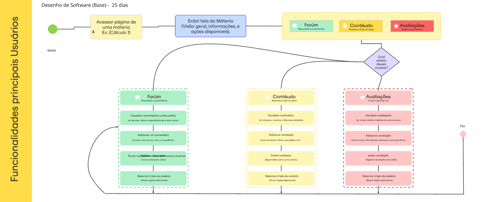
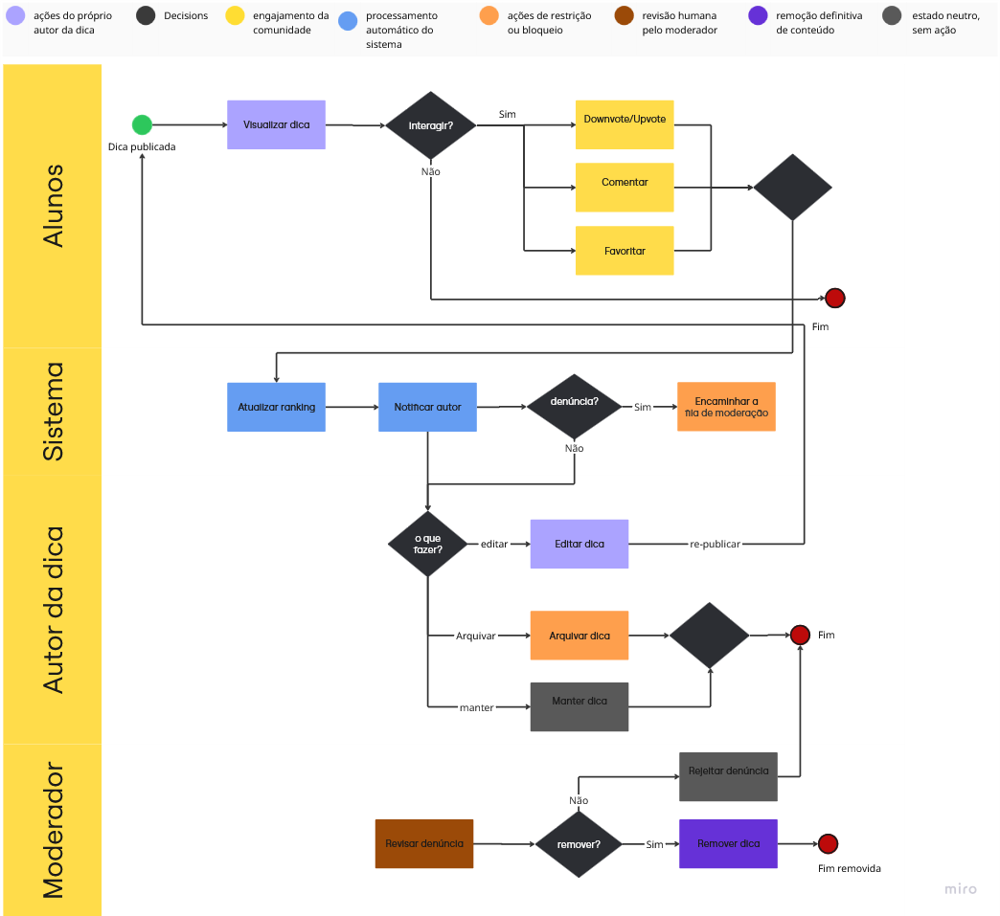
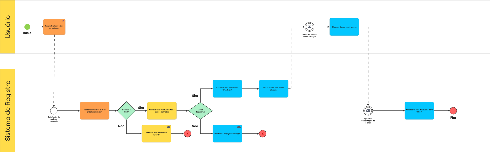

# Modelagem BPMN

## Visão Geral e Abordagem

Este documento detalha a modelagem BPMN (_Business Process Model and Notation_) adotada pela equipe para o ciclo de vida do desenvolvimento do Fórum UnB.

Para estruturar nosso fluxo de trabalho de ponta a ponta, combinamos práticas ágeis focadas em ideação rápida, desenvolvimento iterativo e gestão contínua de fluxo. O nosso viés metodológico é composto pela integração de **Design Sprint**, **Scrum** e **Kanban**.

## Modelagem dos Processos (BPMN)

Abaixo estão representados os fluxos de trabalho adotados pela equipe, divididos em três perspectivas metodológicas complementares:

### Processo de Concepção das Sprints: Design Sprint

Este fluxo mapeia como a equipe executa a ideação, rascunho, decisão e prototipação de novas grandes funcionalidades, garantindo alinhamento antes do desenvolvimento (como ocorreu na fase inicial do Fórum).

Imagem 1: Fluxo Design Sprint

Fonte: [Diogo Oliveira](https://github.com/Diogo-Olivv), 2026.

Imagem 2: Fluxo Design Sprint V2

Fonte: [João Gabriel](https://github.com/https://github.com/JoaoComTil), 2026.

### Framework Ágil: Scrum

Este modelo detalha o ciclo de vida dos nossos _Sprints_, ilustrando as cerimônias (Planning, Daily, Review, Retrospective) e os papéis definidos para o desenvolvimento contínuo do sistema.

Imagem 3: Fluxo Scrum

Fonte: [Marcos](https://github.com/marcoslbz), 2026.

### Quadro de Gestão de Tarefas: Kanban

Este fluxo demonstra o ciclo de vida de uma _Issue_ ou Tarefa individual (desde a criação no _Backlog_, transição para _In Progress_, _Code Review_ e _Done_), garantindo controle sobre gargalos técnicos.

Imagem 4: Fluxo Kanban

  
Fonte: [Felipe Rodrigues](https://github.com/felipeJRdev), 2026.

### Quadro com as principais Funcionalidades dos Usuários

Esse fluxo descreve a navegação do usuário na página da matéria, permitindo acessar Fórum, Conteúdos e Avaliações, interagir com cada seção e retornar à página principal.

Imagem 5: Fluxo Funcionalidades

  
Fonte: [Brenda Silva](https://github.com/Brwnds), 2026.

### Mapeamento do Domínio: Ciclo de Vida da Dica

Diferente dos fluxos de gestão de equipe, este diagrama detalha a lógica interna do software. Ele mapeia o estado de uma informação (dica) desde a sua postagem, passando pelo engajamento (votos), atualizações do autor, até o seu eventual arquivamento ou consagração como dica maxima.

Imagem 6: Fluxo Ciclo de Vida da Dica

  
Fonte: [Angélica](https://github.com/angelicaccampos), 2026.

### Quadro do Fluxo de Cadastro de Usuário

Este fluxograma detalha o processo de cadastro de novos usuários, estabelecendo as etapas de validação cadastral e ativação de conta para controle de acesso à plataforma.

  
Fonte: [Gabriel Maciel](https://github.com/GabrielMacielBR), 2026.

## Justificativas

Adotamos uma estratégia híbrida do Scrum adaptado foi escolhida estrategicamente pela equipe pelos seguintes motivos:

- **Por que Design Sprint:** Permitiu validar o escopo da integração com o SIGAA e a interface gamificada em apenas 5 dias, mitigando o risco de desenvolver algo que o público-alvo (alunos) não usaria.
- **Por que Scrum:** Estabelece um ritmo cadenciado (timebox), o que é vital para conciliar o desenvolvimento do projeto com o calendário acadêmico do semestre.
- **Por que Kanban:** O Scrum dita o ritmo, mas o Kanban permite visualizar o fluxo de trabalho diário. Foi adotado para dar transparência ao status de cada _feature_ e evitar sobrecarga em membros específicos.

## Bibliografia

- SERRANO, Milene. Arquitetura e Desenho de Software - Aula Projeto-DSW. UnB Gama.

## Histórico de Versões

Tabela 1: Histórico de versões

| Versão | Descrição                                 | Autor                                            | Data       |
| ------ | ----------------------------------------- | ------------------------------------------------ | ---------- |
| 1.0    | Refatoração do arquivo + Upload dos BPMNs | [Diogo Oliveira](https://github.com/Diogo-Olivv) | 05/04/2026 |
| 1.1    | Padronização de legendas e fontes de autoria nos artefatos. | [Felipe Rodrigues](https://github.com/felipeJRdev) | 05/04/2026 |
2.0 | Adição de Quadro com as principais Funcionalidades dos Usuários | [Brenda Silva](https://github.com/Brwnds)| 06/04/2026 |
2.1 | Adição de Mapeamento do Domínio: Ciclo de Vida da Dica | [Angélica Campos](https://github.com/angelicaccampos) | 06/04/2026 |
2.2 | Adição de Fluxo de Cadastro de Usuário | [Gabriel Maciel](https://github.com/GabrielMacielBR) | 06/04/2026 |
2.3 | Adição da V2 do Fluxo de design Sprint | [Renan Ribeiro](https://github.com/rsribeiro1) | 06/04/2026 |

