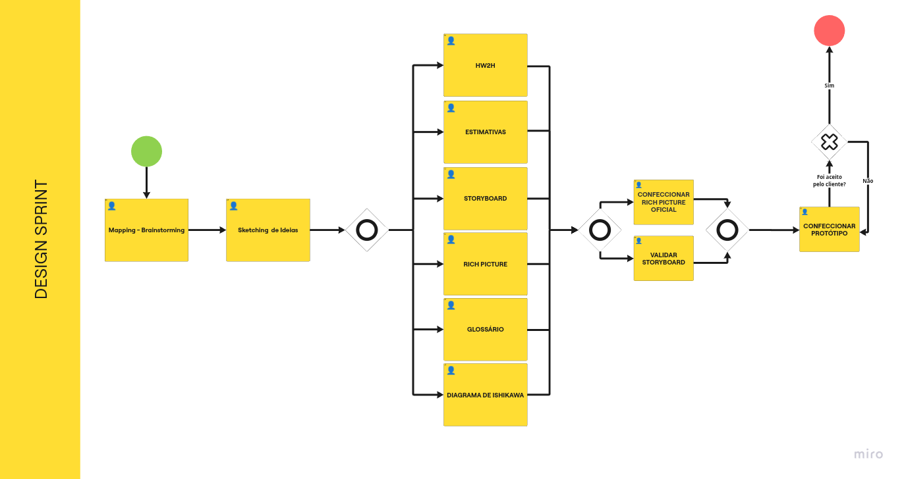
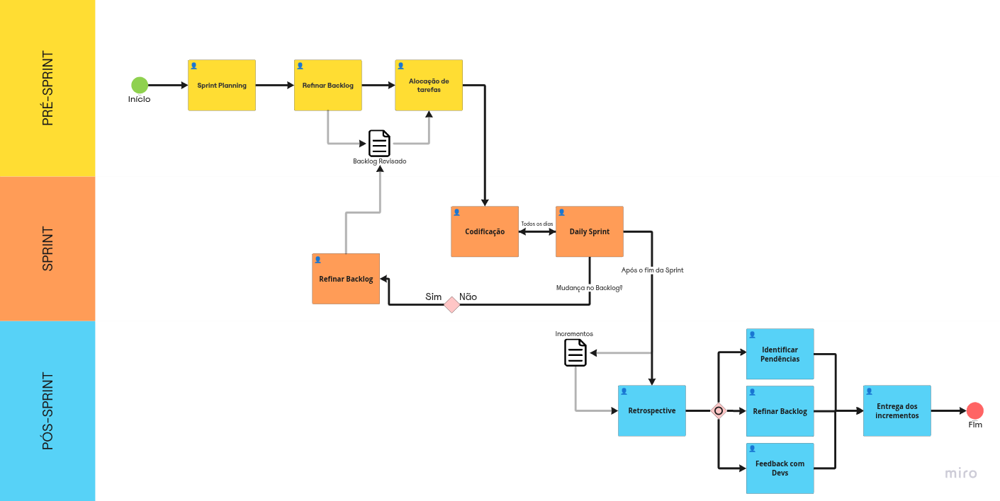
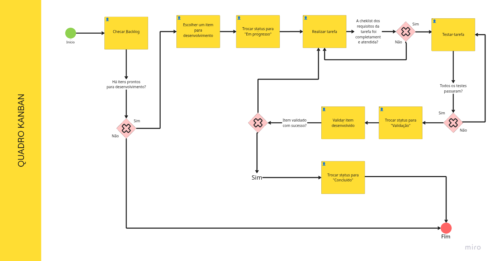

# Modelagem BPMN

## Visão Geral e Abordagem

Este documento detalha a modelagem BPMN (_Business Process Model and Notation_) adotada pela equipe para o ciclo de vida do desenvolvimento do Fórum UnB.

Para estruturar nosso fluxo de trabalho de ponta a ponta, combinamos práticas ágeis focadas em ideação rápida, desenvolvimento iterativo e gestão contínua de fluxo. O nosso viés metodológico é composto pela integração de **Design Sprint**, **Scrum** e **Kanban**.

---

## Modelagem dos Processos (BPMN)

Abaixo estão representados os fluxos de trabalho adotados pela equipe, divididos em três perspectivas metodológicas complementares:

### Processo de Concepção das Sprints: Design Sprint

Este fluxo mapeia como a equipe executa a ideação, rascunho, decisão e prototipação de novas grandes funcionalidades, garantindo alinhamento antes do desenvolvimento (como ocorreu na fase inicial do Fórum).

### Framework Ágil: Scrum

Este modelo detalha o ciclo de vida dos nossos _Sprints_, ilustrando as cerimônias (Planning, Daily, Review, Retrospective) e os papéis definidos para o desenvolvimento contínuo do sistema.

### Quadro de Gestão de Tarefas: Kanban

Este fluxo demonstra o ciclo de vida de uma _Issue_ ou Tarefa individual (desde a criação no _Backlog_, transição para _In Progress_, _Code Review_ e _Done_), garantindo controle sobre gargalos técnicos.

---

## Justificativas

Adotamos uma estratégia híbrida do Scrum adaptado foi escolhida estrategicamente pela equipe pelos seguintes motivos:

- **Por que Design Sprint:** Permitiu validar o escopo da integração com o SIGAA e a interface gamificada em apenas 5 dias, mitigando o risco de desenvolver algo que o público-alvo (alunos) não usaria.
- **Por que Scrum:** Estabelece um ritmo cadenciado (timebox), o que é vital para conciliar o desenvolvimento do projeto com o calendário acadêmico do semestre.
- **Por que Kanban:** O Scrum dita o ritmo, mas o Kanban permite visualizar o fluxo de trabalho diário. Foi adotado para dar transparência ao status de cada _feature_ e evitar sobrecarga em membros específicos.

## Bibliografia

- SERRANO, Milene. Arquitetura e Desenho de Software - Aula Projeto-DSW. UnB Gama.

---

## 5. Histórico de Versões

| Versão | Descrição                                 | Autor                                            | Data       |
| ------ | ----------------------------------------- | ------------------------------------------------ | ---------- |
| 1.0    | Refatoração do arquivo + Upload dos BPMNs | [Diogo Oliveira](https://github.com/Diogo-Olivv) | 05/04/2026 |
